### parent
- split readline on pipe token '|'
- count number of processes, put result in context
- build sub/child processes in a supervisor/parent process
- 
- in sub process

1. tokenize
1. pipex
1. command struct

### envp

- [.] lookup to see how to parse
- [.] put in a list
- [.] set up at the end of execution
- [.] used in path expansion

### pipes

- [.] split commands -> cmd_lst
- [.] adjust cmd structure -> add stuff when needed
- [.] list errors

#### split commands

take the token list and split in two at pipe token

```mermaid
flowchart TD
	s((START)) --> vp{valid pipe?}
	vp -- yes --> st[split token list in two\n!!! free pipe]
	st --> e((END))
	subgraph  
	st -. 1 .-> cmd1_tk[\cmd1.token_lst\]
	st -. 2 .-> cmd2_tk[\cmd2.token_lst\]
	end
	vp -- no --> serr[syntax error]
	serr --> e

	classDef air_force_blue fill:#628395
	classDef dusty_taupe fill:#96897B
	classDef midnight_violet fill:#420039
	class s,e air_force_blue
	class st,serr dusty_taupe
```

### redirs

- [] split redirs

- IN (<) cannot have filename which isnt valid path, nothing comes from nowhere right? the error message is as follows
"bash: <filename>: no such file or directory"

- OUT (>) can have filename which arent in current path. As long as it doesnt need to be in a folder which doesnt exist, a file is created if need be.

